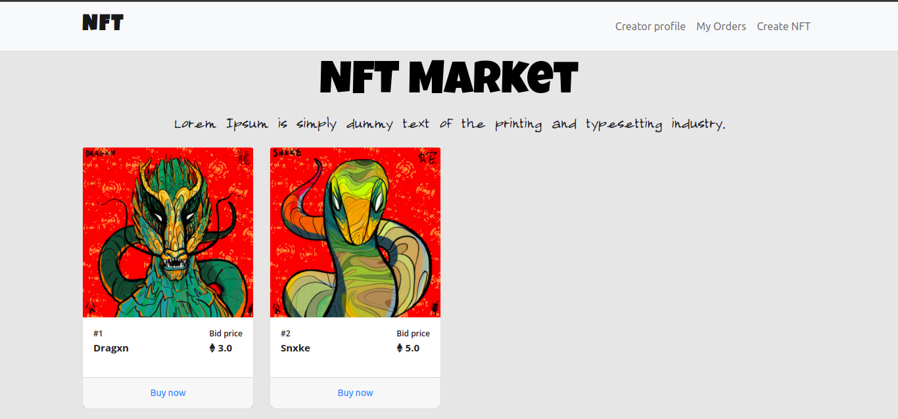
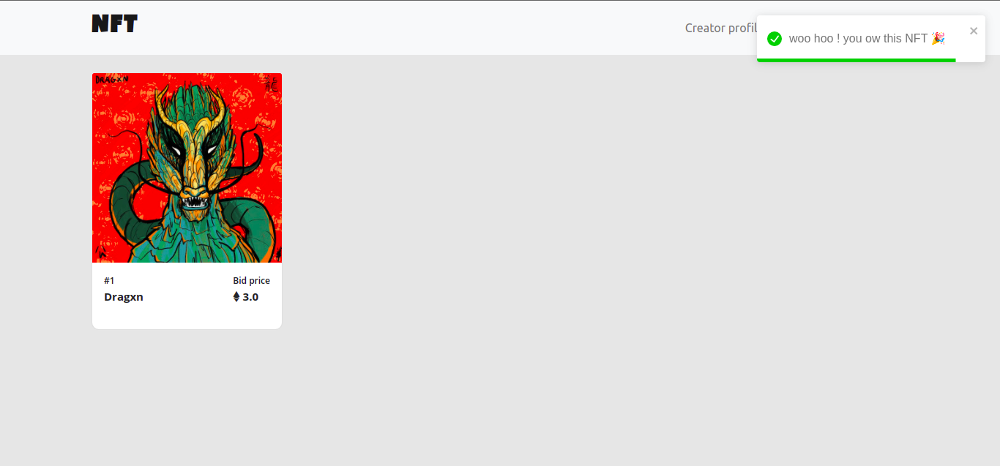
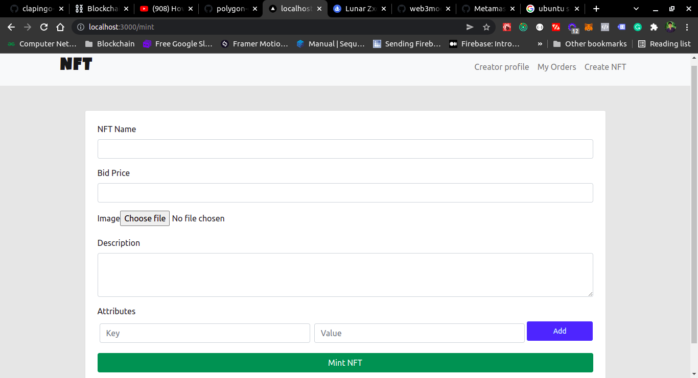

# NFT Marketplace
### Tech stack & packages used :man_technologist:
- Next.js ,solidity ,hardhat ,mocha, chai, ether.js,Redux, openzeppelin, Ipfs http client & waffle
### Marketplace features :bulb:
- [x] Mint & List Nft.
- [x] Buy NFT.
- [x] Sell NFT.
- [x] Connect with waller.


### NFT list


### Buy NFT


### Mint NFT


### How to run :runner: :
----------------
- Run hardhat node
    ```
    npx hardhat node
    ```
- Run test cases
    ```
    npx hardhat test
    ```
- Deploy contract in local hardhat node
    ```
    npx hardhat run scripts/deploy.js --network localhost
    ```
- Connect hardhat with metamask
- Run react frontend
    ```
    cd client
    npm start
    ```

[ERC-721 token details](https://github.com/OpenZeppelin/openzeppelin-contracts/tree/master/contracts/token/ERC721)

[Ethers.js documentation](https://docs.ethers.io/v5/getting-started/)

```shell
npx hardhat accounts
npx hardhat compile
npx hardhat clean
npx hardhat test
npx hardhat node
node scripts/deploy.js
npx hardhat help
npx hardhat run scripts/deploy.js --network localhost
```
